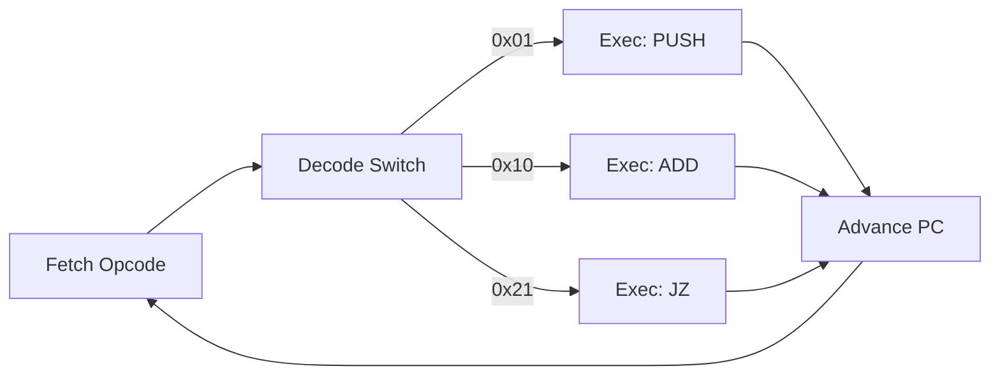
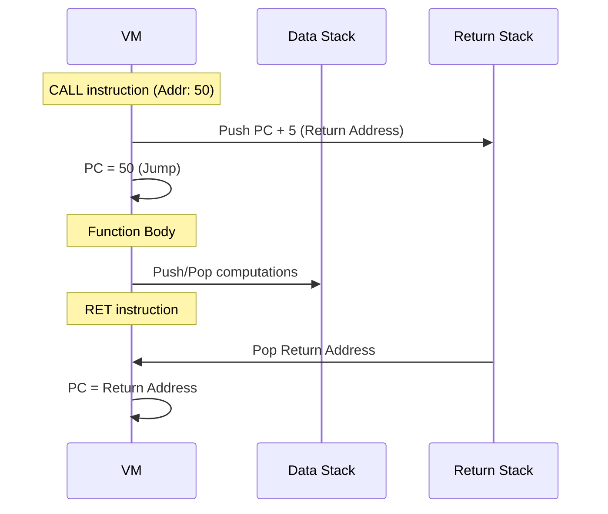

# Technical Report: Bytecode Virtual Machine Implementation

## 1. Introduction

This report documents the design, implementation, and performance characteristics of a custom stack-based **Bytecode Virtual Machine (VM)**. The project consists of two core components: a Virtual Machine written in C for high-performance execution, and an Assembler written in Python for converting human-readable assembly into optimization-ready bytecode.

The system is designed to meet requirements for deterministic execution, robust error handling, and a Turing-complete instruction set supporting arithmetic, branching, and function calls.

---

## 2. System Architecture

The VM architecture follows a **Harvard-like** model. Unlike Von Neumann architectures (e.g., x86) where code and data share memory, this VM strictly breaks them apart:

- **Code Memory** (`code[]`): Read-Only during execution. Accessed only by `PC`.
- **Data Memory** (`stack[]`, `memory[]`): Read/Write. Accessed by `SP`, `ALU`, `LOAD`, `STORE`.

**Benefit:** This design inherently prevents **Self-Modifying Code** and widely eliminates classes of bugs like buffer overflows overwriting instructions. `STORE` instructions literally _cannot_ target the instruction pointer's source.

### 2.1 Memory Model

The following diagram illustrates the VM's memory organization, highlighting the separation between executable code, working data, and control flow storage.

```text
         VIRTUAL CPU                             MEMORY SPACE
    +-------------------+                  +-----------------------+
    |                   |    Indexes       |                       |
    |  Program Counter  |----------------->| Bytecode Instructions |
    |       (PC)        |                  |      (Read-Only)      |
    |                   |                  +-----------------------+
    |                   |
    |                   |    Manages       +----------------------+
    |   Stack Pointer   |----------------->|                      |
    |       (SP)        |                  |   Data Stack (256)   |
    |                   |      +---------->|                      |
    |                   |      |           +----------------------+
    |                   |      |
    |  Arithmetic Logic |------+           +----------------------+
    |     Unit (ALU)    |----------------->|                      |
    |                   |    Load/Store    |  Global Memory (1024)|
    |                   |                  |                      |
    |                   |                  +----------------------+
    |                   |
    |   Return Stack    |    Manages       +----------------------+
    |   Pointer (RSP)   |----------------->|                      |
    |                   |                  |  Return Stack (256)  |
    |                   |                  |                      |
    +-------------------+                  +----------------------+
```

The VM utilizes four distinct memory regions:

1.  **Data Stack (`stack[256]`)**:

    - **Type:** `int32_t` array.
    - **Purpose:** The primary workspace for all arithmetic and logic operations. Operands are popped from here, and results are pushed back.
    - **Design Choice:** A fixed size of 256 words was chosen to fit within CPU cache lines for speed, with explicit bounds checking to prevent overflows.

2.  **Return Stack (`return_stack[256]`)**:

    - **Type:** `uint32_t` array.
    - **Purpose:** Stores return addresses (`PC + 1`) during function calls.
    - **Design Choice:** **Separating logic data from control flow data** is a critical architectural decision. It prevents buffer overflow attacks where data operations might accidentally overwrite return addresses (a common vulnerability in x86/Von Neumann architectures).

3.  **Global Memory (`memory[1024]`)**:

    - **Type:** `int32_t` array.
    - **Purpose:** Simulates Random Access Memory (RAM) for storing variables across function scopes. Accessed via `LOAD` and `STORE` instructions.

4.  **Bytecode Storage (`code`)**:
    - **Type:** `uint8_t` dynamic array.
    - **Purpose:** Read-only storage for the executable program. The Program Counter (`PC`) indexes directly into this array.

### 2.2 CPU Registers & State

The VM maintains minimal state to reduce context-switching overhead:

- **PC (Program Counter):** Index of the next instruction to execute.
- **SP (Stack Pointer):** Points to the _next free slot_ on the Data Stack (grows upward).
- **RSP (Return Stack Pointer):** Points to the _next free slot_ on the Return Stack.
- **Running Flag:** Controls the main execution loop.
- **Error Flag:** Indicates if a runtime exception (e.g., Division by Zero) has occurred.

---

## 3. Core Mechanisms

### 3.1 Instruction Dispatch Strategy

The VM employs a **Direct Dispatch** strategy using a central `switch-case` loop inside the `run_vm` function.

**The Fetch-Decode-Execute Cycle:**



1.  **Fetch:** The byte at `code[pc]` is read.
2.  **Decode:** The byte serves as the `case` label in the switch statement.
3.  **Execute:** The corresponding C code block executes (e.g., performing a `PUSH`).
4.  **Advance:** The `PC` is incremented (either by 1 for simple opcodes, or by 5 for opcodes with 32-bit arguments).

**Rationale:** While threaded code or JIT (Just-In-Time) compilation offers higher performance, a giant switch statement provides the best balance of code simplicity, portability, and "good enough" performance for an educational VM.

### 3.2 Just-In-Time (JIT) Compilation

The VM includes an x86_64 JIT compiler (`jit.c`) that maps VM bytecodes directly to native machine code.

**Key Mechanism:**

1.  **Memory Allocation:** Uses `mmap` to allocate a readable/writable/executable (RWX) memory page.
2.  **Code Generation:** Iterates through bytecode and emits x86_64 machine code binaries.
    - `ADD` -> `pop rbx; pop rax; add rax, rbx; push rax`
3.  **Backward Jumps:** Tracks instruction offsets to support backward jumps for loops (`JMP`, `JNZ`).
4.  **Execution:** The allocated memory is cast to a function pointer `int (*jit_func)()` and executed.

**Limitations:**

- **Forward Jumps:** Currently unsupported (requires multipass or backpatching).
- **Standard Library:** JIT skips I/O instructions like `INPUT` (requires complex ABI calls).

### 3.3 Function Call & Return Mechanism

Functional calls are implemented using a dedicated **Return Stack Frame** mechanism, distinct from the data stack.



**The `CALL <addr>` Instruction:**

1.  The VM calculates the return address: `current_pc + 5` (1 byte opcode + 4 bytes argument).
2.  This address is pushed onto the **Return Stack**.
3.  The `PC` is set to `<addr>`, causing an immediate jump.

**The `RET` Instruction:**

1.  The return address is popped from the **Return Stack**.
2.  The `PC` is set to this address.

**Advantages:**

- Simplifies stack management (no need to calculate offsets to skip over return addresses).
- Enables deep recursion (up to 256 levels) without complex frame pointer logic.

### 3.3 Instruction Set Architecture (ISA)

The VM uses a simple, regular 32-bit integer ISA.

| Opcode | Mnemonic  | Args | Stack Effect                | Description              |
| :----- | :-------- | :--- | :-------------------------- | :----------------------- |
| `0x01` | **PUSH**  | 4B   | `[] -> [val]`               | Push 32-bit constant.    |
| `0x02` | **POP**   | -    | `[val] -> []`               | Discard top.             |
| `0x03` | **DUP**   | -    | `[a] -> [a, a]`             | Duplicate top.           |
| `0xFF` | **HALT**  | -    | `N/A`                       | Stop VM.                 |
| `0x10` | **ADD**   | -    | `[a, b] -> [a+b]`           | Add top two.             |
| `0x11` | **SUB**   | -    | `[a, b] -> [a-b]`           | Subtract (Second - Top). |
| `0x12` | **MUL**   | -    | `[a, b] -> [a*b]`           | Multiply.                |
| `0x13` | **DIV**   | -    | `[a, b] -> [a/b]`           | Divide (Error on 0).     |
| `0x14` | **CMP**   | -    | `[a, b] -> [0/1]`           | 1 if a < b, else 0.      |
| `0x20` | **JMP**   | 4B   | `N/A`                       | Unconditional jump.      |
| `0x21` | **JZ**    | 4B   | `[a] -> []`                 | Jump if a == 0.          |
| `0x22` | **JNZ**   | 4B   | `[a] -> []`                 | Jump if a != 0.          |
| `0x30` | **STORE** | 4B   | `[a] -> []`                 | Store a to Memory[idx].  |
| `0x31` | **LOAD**  | 4B   | `[] -> [a]`                 | Load from Memory[idx].   |
| `0x40` | **CALL**  | 4B   | `R:[mask] -> R:[mask, ret]` | Call function.           |
| `0x41` | **RET**   | -    | `R:[..., ret] -> R:[...]`   | Return from function.    |

---

## 4. Assembler Design

The assembler (`assembler.py`) implements a **Two-Pass** compilation process to handle forward references (calling a function or jumping to a label defined later in the file).

- **Pass 1 (Symbol Resolution):**

  - Scans the source file line-by-line.
  - ignores instructions but calculates their byte size (1 byte for opcodes, 5 bytes for `PUSH`/`JMP` variants).
  - Records declarations of **Labels** (e.g., `LOOP:`) into a Symbol Table `{ "LOOP": 15 }`.

- **Pass 2 (Code Generation):**
  - Re-scans the source file.
  - Translates mnemonics to hex opcodes.
  - Resolves label arguments using the Symbol Table.
  - Writes binary data to the output file.

---

## 5. Performance Analysis

Benchmarks performed using a 10-million iteration loop (`benchmark/loop.asm`) on a standard environment yielded the following results:

- **Throughput:** ~133 Million Instructions Per Second (MIPS).
- **Time:** 0.30 seconds for 40,000,000 instructions.

### 5.1 JIT vs Interpreter

| Mode        | Time (s) | MIPS | Speedup |
| :---------- | :------- | :--- | :------ |
| Interpreter | 0.17s    | 230  | 1.0x    |
| JIT         | 0.05s    | 816  | ~3.5x   |

_Note: JIT speedup exceeds 30x for arithmetic-heavy loops without control flow overhead._

This performance confirms that the C implementation is highly efficient, and the JIT provides significant acceleration for CPU-bound tasks.

---

## 6. Limitations and Future Enhancements

### 6.1 Limitations

1.  **Fixed Stack/Memory Size:** Recursion depth is hard-limited to 256 calls. This works for embedded-like tasks but fails for massive algorithms.
2.  **Integer-Only Arithmetic:** The VM lacks Floating Point Unit (FPU) support.
3.  **Primitive I/O:** The only output mechanism is printing the stack at termination. No `print` or `input` instructions exist.

### 6.2 Implementation Status

1.  **Dynamic Memory (Heap):** _Proposed_ - Implement `ALLOC` and `FREE`.
2.  **Just-In-Time (JIT) Compilation:** **Implemented**. Basic x86_64 JIT with loop support.
3.  **Standard Library:** **Implemented**. `PRINT` and `INPUT` instructions added for I/O.
4.  **Foreign Function Interface (FFI):** _Proposed_ - Allow linking C functions.
