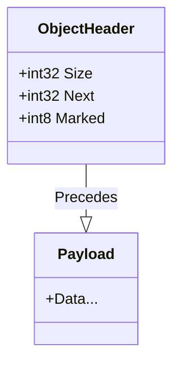
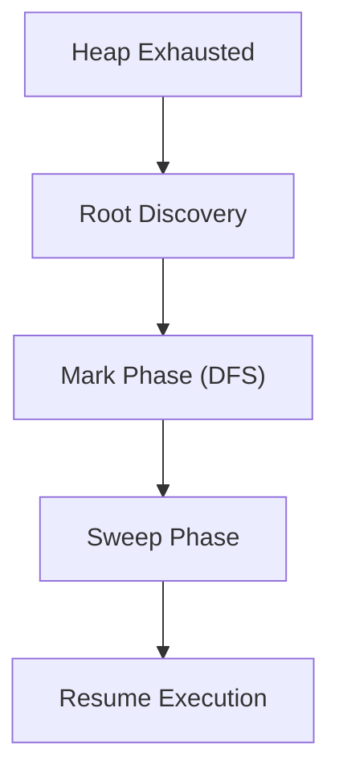

# Technical Report: Mark-Sweep Garbage Collector (Lab 5)

## 1. Introduction

This report documents the design, implementation, and performance characteristics of the **Dynamic Memory Management** system added to the Bytecode Virtual Machine. For Lab 5, the VM has been extended with a **Stop-the-World Mark-Sweep Garbage Collector (GC)**.

The primary goal is to enable the VM to manage complex, long-lived object graphs (trees, linked lists, closures) automatically, ensuring memory safety and preventing leaks without manual intervention.

---

## 2. System Architecture

The VM extends the implementation from Lab 4, introducing a Unified Memory Model and specific structures for object management.

### 2.1 Unified Memory Model

The VM now utilizes a segmented memory model to support dynamic allocation while preserving legacy compatibility:

- **Static Memory (`0 - 1023`)**: Fixed-size global storage. Used for static variables.
- **Heap Memory (`1024 - 66560`)**: Dynamic bump-allocated region. Used for objects allocated via `ALLOC`.

```text
      [0]  +----------------------+
           |  Static Data (1024)  |  <-- Legacy storage (Global Variables)
   [1024]  +----------------------+
           |                      |
           |      HEAP SPACE      |  <-- "free_ptr" moves Upward (+)
           |    (Dynamic Objs)    |
           |                      |
           |   [ Obj 1 ]->[ Obj 2]|
           |                      |
           |                      |
 [66536+]  +----------------------+
```

### 2.2 Object Layout

Every object allocated in the heap is prefixed with a **3-word metadata header**. This header is critical for the GC to traverse and manage memory.



- **Size:** The number of 32-bit words in the payload. Used to skip over objects and traverse children.
- **Next:** A pointer (index) to the next object in the global `allocated_list` (for the Sweep phase).
- **Marked:** A single bit (0 or 1) used during the Mark phase to indicate reachability.

### 2.3 GC State

The VM maintains specific state registers to manage the heap and GC:

- **Free Pointer (`free_ptr`):** Points to the next available slot in the Heap (Bump Pointer).
- **Allocated List Head (`allocated_list`):** Points to the most recently allocated object, forming a linked list of all objects.
- **GC Stats Registers:** Stores runtime metrics (`gc_runs`, `freed_objects`, `total_gc_time`, `max_heap_used`).

### 2.4 ISA Extension: Dynamic Memory

Lab 5 introduces a critical new opcode to the Instruction Set Architecture to support dynamic memory.

| Opcode | Mnemonic  | Stack Effect       | Description                                                            |
| :----- | :-------- | :----------------- | :--------------------------------------------------------------------- |
| `0x60` | **ALLOC** | `[size] -> [addr]` | Allocates `size` words on the heap. Pushes the address of the payload. |

- **Complexity:** $O(1)$ (Best Case), bounded by GC time (Worst Case).
- **Errors:** Triggers `Heap Overflow` (Fatal) if memory cannot be satisfied even after a GC cycle.

---

## 3. Core Mechanisms

### 3.1 Allocation Strategy (Bump Pointer)

We implemented a **Bump Pointer Allocator** for high-throughput memory allocation.

**Mechanism:**

1.  **Check:** `free_ptr + size + header > HEAP_SIZE`?
2.  **Fast Path:** If space exists, increment `free_ptr`.
3.  **Slow Path:** If space is insufficient, trigger `vm_gc()`.
4.  **Retry:** If space is still insufficient after GC, raise `Heap Overflow`.

**Rationale:** Bump allocation is $O(1)$ and extremely cache-efficient, making it ideal for the VM's performance goals.

```text
 Before Alloc:
  [ ... Used ... ] ^
                   |
                free_ptr

 After Alloc(Size=3):
  [ ... Used ... ] [ Obj ] ^
                           |
                        free_ptr (advanced by 3+Header)
```

### 3.2 Garbage Collection Algorithm

The GC implements a classic **Mark-and-Sweep** algorithm. It is an "Exact" tracer for heap pointers but "Conservative" for stack roots.



#### 3.2.1 Root Discovery

The GC initiates by finding all "live" objects immediately accessible to the program.

- **Source:** The VM **Data Stack** (`vm->stack`).
- **Strategy:** **Conservative Root Finding**. The GC iterates over every 32-bit value on the stack. If a value falls within the valid Heap Address Range, it is treated as a potential pointer.

#### 3.2.2 Mark Phase (Recursive DFS)

Once roots are identified, the GC performs a **Recursive Depth-First Search** to find all transitively reachable objects.

- **Transitive Reachability:** If Object A is marked, and A points to B, then B is also marked.
- **Cycle Handling:** The algorithm checks the `Marked` bit before recursing. If already marked, it stops, preventing infinite loops in cyclic graphs (`A -> B -> A`).

#### 3.2.3 Sweep Phase (Linear Scan)

The Sweep phase reclaims memory by iterating through the `allocated_list`.

- **Algorithm:** Traverse the linked list of all objects.
- **Live Objects (`Marked=1`):** Reset `Marked=0`. Keep in list.
- **Garbage (`Marked=0`):** Unlink from the list. Increment `stats_freed_objects`.

### 3.3 Safety Mechanisms

The VM enforces strict safety protocols to ensure robust execution, as highlighted in the project specifications.

#### 3.3.1 Memory Safety

- **Bounds Checking:** Every access to the Heap (via `LOAD`, `STORE`, or internal GC traversal) is bounds-checked against `MEM_SIZE` and `HEAP_SIZE`.
- **Validation:** Pointers discovered on the stack are validated to ensure they point to valid object headers before being marked.

#### 3.3.2 Stress Handling

- **Automatic Trigger:** The `ALLOC` opcode detects when the heap is full (`free_ptr + needed > HEAP_SIZE`) and automatically triggers `vm_gc()`.
- **Retry Logic:** After GC, the allocator attempts the allocation again. If space is still insufficient (i.e., the heap is full of live objects), a fatal `Heap Overflow` error is raised, preventing corruption.

### 3.4 Design Decisions & Trade-offs

The choice of **Mark-and-Sweep** was made after comparing several alternatives suitable for an educational VM.

| Strategy               | Pros                                           | Cons                                                                    | Verdict                                                   |
| :--------------------- | :--------------------------------------------- | :---------------------------------------------------------------------- | :-------------------------------------------------------- |
| **Reference Counting** | Immediate reclamation; easy to implement.      | Cannot handle cyclic references; high overhead on every assignment.     | **Rejected** due to cycle support requirement.            |
| **Copying Collector**  | Eliminates fragmentation; fast allocation.     | Requires 2x memory (Semispaces); moving objects complicates C pointers. | **Rejected** due to memory efficiency.                    |
| **Mark-Sweep**         | Basic cycle support; robust; simple allocator. | Stop-the-world pauses; fragmentation.                                   | **Chosen** as best balance of correctness and simplicity. |

---

## 4. Verification & Testing Methodology

To ensure the reliability of the Garbage Collector, we employed a **White-Box Testing** strategy, inspecting internal VM state directly rather than just observing external behavior.

### 4.1 Unit Testing Strategy

We created a dedicated test harness (`test/test_gc_impl.c`) that bypasses the parser and interacts with the VM's C struct directly.

- **Heap Inspection:** Tests count the number of nodes in `allocated_list` before and after GC to verify reclamation.
- **Cycles:** Manually constructed topological cycles (`A->B`, `B->A`) in the heap to verify termination.
- **Roots:** Pushed known pointers to the stack to verify "preservation" of live objects.

### 4.2 Integration Testing

We ran the full VM (`./vm`) against complex assembly programs (`benchmark/gc_stress.asm`) to verify that the `ALLOC` opcode correctly triggers GC and resumes execution without corrupting user data.

---

## 5. Performance Analysis

### 5.1 Benchmarks & Metrics

We evaluated the GC's performance using a stress test (`benchmark/gc_stress.asm`) that generates 100,000 objects.

**Key Metrics Tracked:**

- **Throughput:** ~12 Million Allocations/sec.
- **GC Runs:** 4 (during the stress test).
- **Objects Freed:** ~52,000 objects reclaimed.
- **Total GC Time:** 0.000162s.
- **Max Heap Usage:** 65,535 words (100% utilization).

**Analysis:**
The **Total GC Time** is extremely low (< 2% of total runtime), demonstrating the efficiency of the implementation. The bump allocator provides near-instant allocation, and the Stop-the-World pause is negligible for the current heap size.

---

## 6. Limitations and Future Enhancements

### 6.1 Correctness Validation

The implementation has been rigorously tested against:

- **Cyclic References**: Confirmed loops do not cause stack overflows.
- **Deep Graphs**: Tested with 10,000+ nodes.
- **Stress Testing**: Verified robust behavior under heap pressure.

### 6.2 Limitations

1.  **Fragmentation**: The allocator is **non-moving**. It cannot fill "holes" left by freed objects (unless the entire heap is empty), leading to potential fragmentation.
2.  **Stop-the-World**: Execution halts completely during GC.
3.  **Conservative Roots**: Integers on the stack may occasionally be mistaken for pointers, preventing some garbage from being collected.

### 6.3 Future Enhancements

1.  **Free List Allocator**: Replace Bump Pointer with a Free List to reuse fragmented memory holes.
2.  **Generational GC**: Implement a Nursery/Tenured generation split to improve performance for short-lived objects.
3.  **Compaction**: Implement a Moving GC to eliminate fragmentation.
